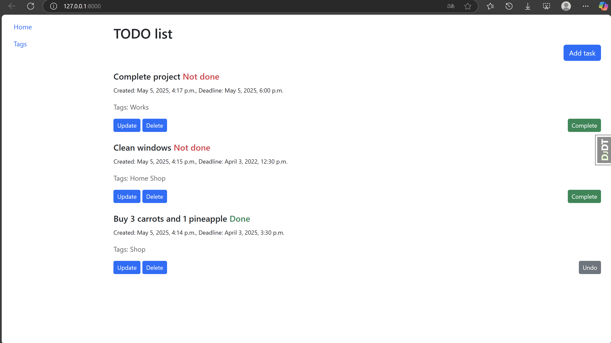

# To-do-list-mate

A Django-based system for managing tasks and tags with a clean and modern frontend.

## Installation

Python3 must be already installed

1. Clone the repository:
git clone https://github.com/Profy8712/To-do-list-mate
cd to-do-list-mate
2. Create and activate virtual environment:
python3 -m venv venv
source venv/bin/activate  # Linux/Mac
venv\Scripts\activate    # Windows
3. Install dependencies:
pip install -r requirements.txt
4. Apply migrations:
python manage.py migrate
6. Run development server:
python manage.py runserver

## Features
- Custom task management system
- CRUD operations for tasks and tags 
- Search and filtering for tasks
- Toggle task completion (Done/Not done)
- Modern Bootstrap 5 UI
- Crispy Forms for beautiful forms
- Responsive design

## Demo

